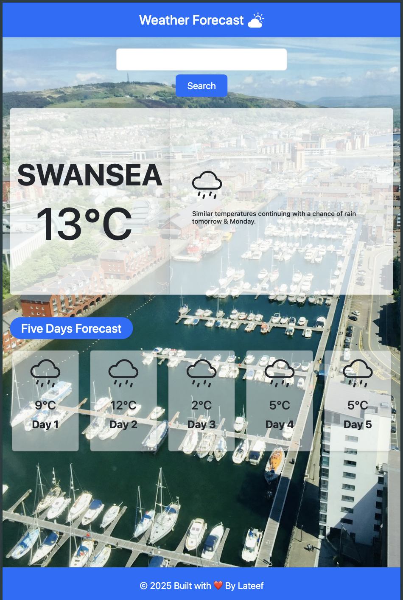

# Weather Forecast App

Live: [https://latakin.github.io/weatherforcast](https://latakin.github.io/weatherforcast)

---

## Features
- Current weather + 5-day forecast  
- Dynamic city background (Unsplash)  
- Fully responsive (Bootstrap 5)  
- Search any city

---

## Setup
git clone https://github.com/latakin/weatherforcast.git
cd weatherforcast
npm install
npm run dev

APIs
Weather: Visual Crossing → add key in getData.js
Images: Unsplash → add key in getImage()

Built with Vite + Bootstrap + JS
© 2025 Lateef — [MIT License](LICENSE)
